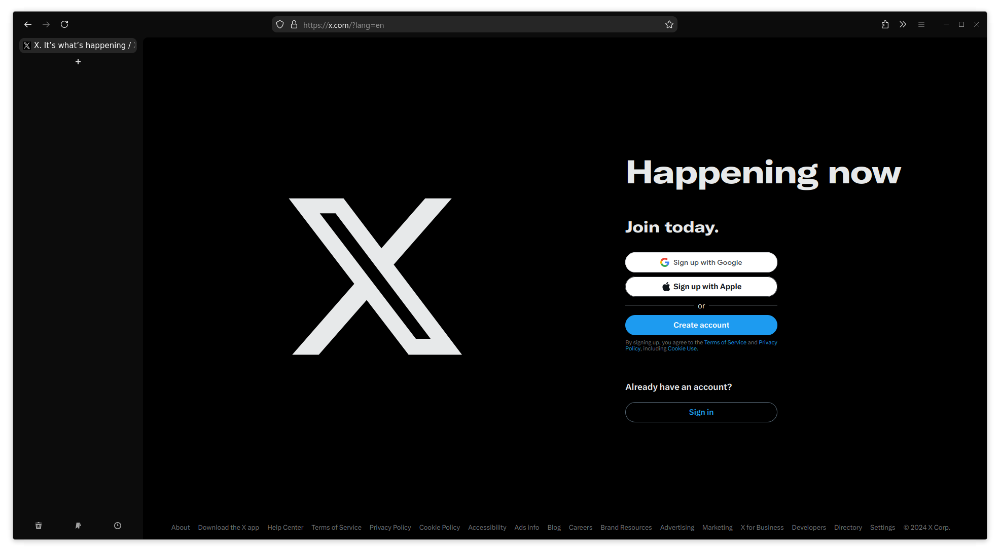

# Minimal Firefox

Custom theme for Firefox using `userChrome.css`, for a more minimal and cleaner experience.  
Colors adjust automatically to the currently open tab.

 
## Screenshots





## Installation

_[How to locate your profile folder](https://support.mozilla.org/en-US/kb/profiles-where-firefox-stores-user-data#w_how-do-i-find-my-profile)_

1. Install [`Adaptive tab bar color`](https://addons.mozilla.org/en-US/firefox/addon/adaptive-tab-bar-colour/) and [Sidebery](https://addons.mozilla.org/de/firefox/addon/sidebery/)
2. Copy the contents of the repository to `[your profile]/chrome` (you have to create this folder)
3. Copy the following contents into `[your profile]/user.js` (or manually set the settings in `about:config` 

```js
user_pref("toolkit.legacyUserProfileCustomizations.stylesheets", true);
user_pref("svg.context-properties.content.enabled", true);
user_pref("widget.gtk.rounded-bottom-corners.enabled", true);
```

(Optional settings:)
```js
user_pref("browser.urlbar.suggest.calculator", true);
user_pref("browser.urlbar.unitConversion.enabled", true);
user_pref("browser.urlbar.trimHttps", false);
user_pref("browser.urlbar.trimURLs", false);
```
